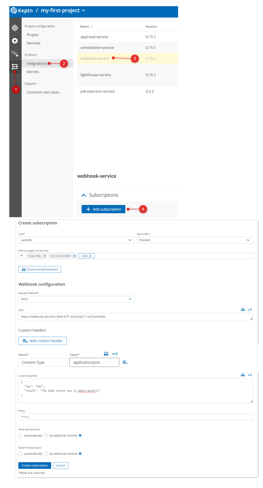
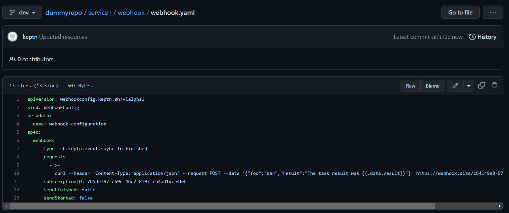

## Active vs. Passive Services

You already have an "active" service - the job executor service is actively running commands and sending the `task.started` and `task.finished` events.

Add a "passive" service to notify when a task is finished.

## Exercise: Notification when task is finished

We want a notification when a task is complete. We want to use the contents of the finished event to do something.

Some examples:

1. Be notified in Slack when an evaluation has finished and receive the result in Slack
2. Build a confluence page automatically based on the output of a load test

### Modify Existing Script

In GitHub, modify your shell script and add a delay:

```
#!/bin/bash

echo "starting script..."

sleep 10

echo "finished script..."
```

Trigger another sequence to ensure it runs.

### Send Notification when Finished

Go to `https://webhook.site`. This site gives you a unique URL and will display anything you send to it.

Try it out: In another tab, go to your unique URL and see that the `GET` request has been registered.


### Task Finished Notification

Go to the integrations screen, select the webhook service and add a subscription for the `sayhello` task `finished` event. Fill in whatever details you like.

Notice you can use variables to grab details from the `finished` event and that this subscription is persisted as code in the git Upstream (you could have automated the creation of this file rather than using the UI).




When done, re-trigger the sequence and wait for the notification on `webhook.site`.


## Exercise: Notify Multiple Tools

Imagine the above was pushing a message to Slack but a customer also wanted a notification into MS Teams (or any other system).

Add a second integration to notify two endpoints when a task finishes.

## Summary

1. This mechanism means tooling is no longer tightly coupled to process. Change notifications easily without redesigning or reworking the process.
2. Add as many notifications as you want and send wherever you like.
3. Process observability is now possible: "I need to know exactly when things happen for each step of the workflow."


